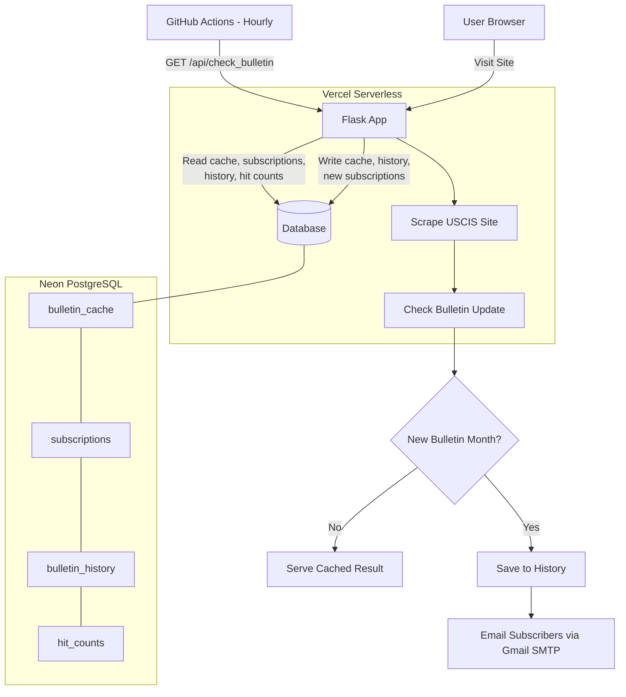

# Visa Bulletin Checker

A web app that tracks the latest U.S. Department of State Visa Bulletin for employment-based (EB) visas, with email notifications when new bulletins are released.

**Live site:** [visa-bulletin-checker.vercel.app](https://visa-bulletin-checker.vercel.app)

## Features

- **Current Bulletin Display** — Scrapes the official [Visa Bulletin](https://travel.state.gov/content/travel/en/legal/visa-law0/visa-bulletin.html) and shows Final Action Dates and Dates for Filing across EB-1, EB-2, and EB-3 categories for all chargeability areas (All Other, China, India, Mexico, Philippines)
- **Email Subscriptions** — Subscribe to get notified when a new bulletin drops. Emails are only sent once per bulletin month, with one-click unsubscribe
- **Historical Trends** — Interactive Chart.js visualizations of priority date movement over time, with color-coded change indicators
- **Automated Checking** — GitHub Actions runs hourly to detect new bulletins and email subscribers

## Tech Stack

| Layer | Tech |
|-------|------|
| Backend | Python, Flask |
| Scraping | BeautifulSoup4, Requests |
| Database | PostgreSQL (Neon) |
| Frontend | HTML/CSS/JS, Chart.js, Font Awesome |
| Deployment | Vercel (serverless) |
| CI/CD | GitHub Actions |
| Email | SMTP (Gmail) |

## Project Structure

```
api/
├── index.py                  # Flask app (routes: /, /history, /unsubscribe)
├── check_bulletin.py         # Cron endpoint (/api/check_bulletin)
├── templates/
│   ├── index.html            # Main bulletin page
│   ├── history.html          # Historical trends page
│   └── unsubscribe.html      # Unsubscribe confirmation
└── utils/
    ├── bulletin.py           # Scraping & formatting
    ├── db.py                 # Database operations
    ├── email.py              # Email sending & validation
    ├── hits.py               # Traffic tracking
    └── subscription.py       # Subscription management
scripts/
└── backfill_history.py       # One-time historical data backfill
.github/workflows/
└── trigger_check_bulletin.yml  # Hourly cron job
```

## Setup

### Prerequisites

- Python 3.12+
- PostgreSQL database (or [Neon](https://neon.tech) cloud instance)
- Gmail account with app password for SMTP

### Environment Variables

| Variable | Description |
|----------|-------------|
| `DATABASE_URL` | PostgreSQL connection string |
| `SMTP_USER` | Gmail address for sending emails |
| `SMTP_PASS` | Gmail app password |
| `CRON_SECRET` | Bearer token to secure the `/api/check_bulletin` endpoint |

### Run Locally

```bash
pip install -r requirements.txt
flask --app api/index run
```

### Deploy to Vercel

The project is configured via `vercel.json` with two serverless functions:
- `/` → `api/index.py`
- `/api/check_bulletin` → `api/check_bulletin.py`

## API Routes

| Route | Method | Description |
|-------|--------|-------------|
| `/` | GET, POST | Main page — displays bulletin, handles subscriptions |
| `/history` | GET | Historical trends with interactive charts |
| `/unsubscribe` | GET | Unsubscribe via email link |
| `/api/check_bulletin` | GET | Cron-triggered endpoint — checks for new bulletins and emails subscribers (requires `CRON_SECRET`) |

## How It Works



1. The app scrapes the State Department's Visa Bulletin index page for the latest bulletin link
2. Parses employment-based tables to extract priority dates for all categories and countries
3. Caches results in the database to minimize scraping
4. When a new bulletin month is detected, emails all subscribers and records history
5. GitHub Actions triggers the check hourly; page visits also trigger a check
